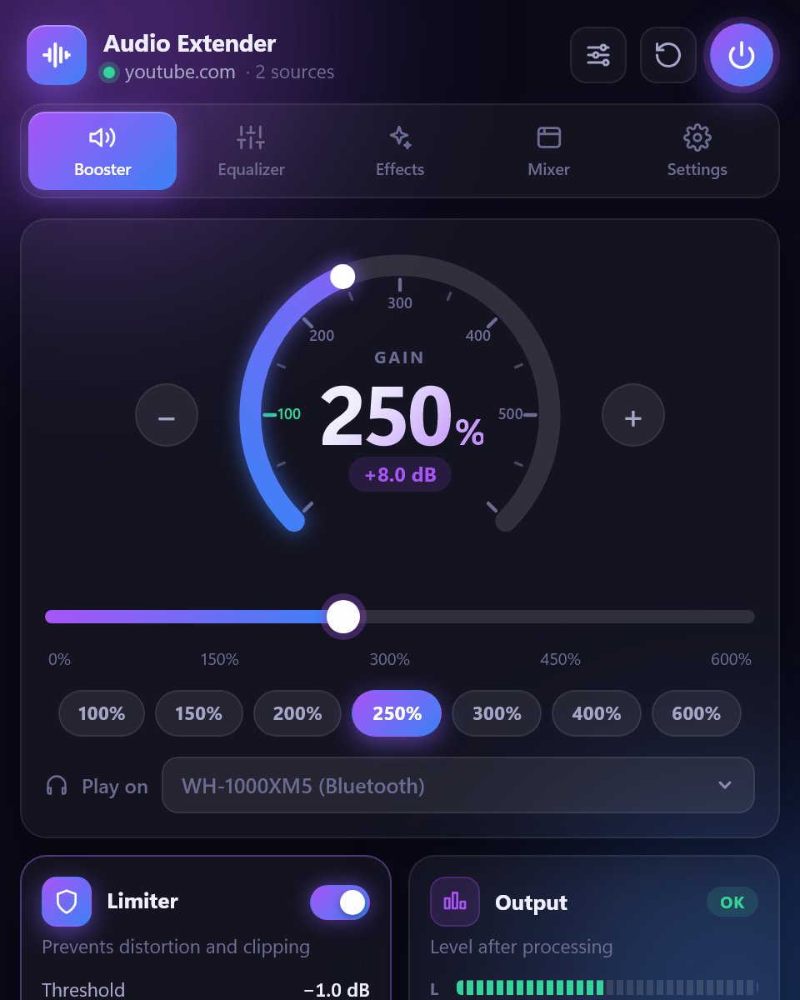
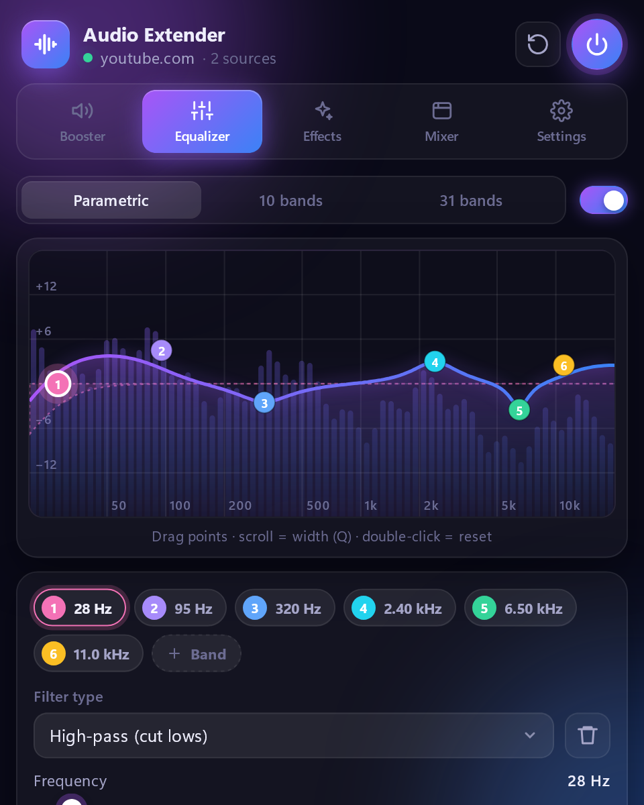
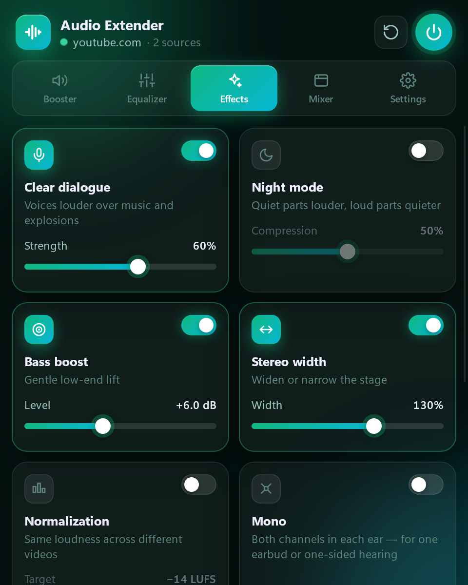
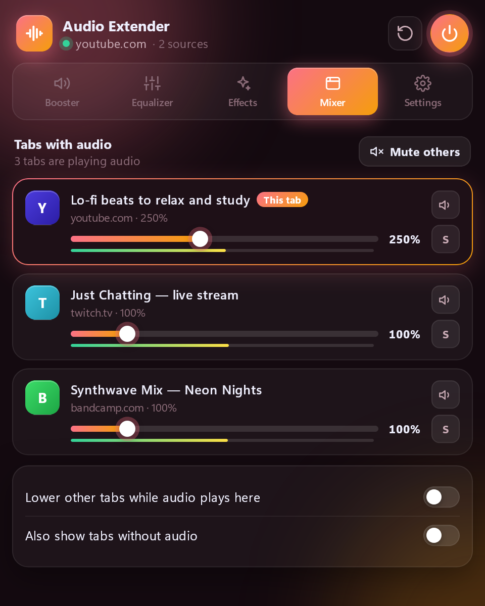
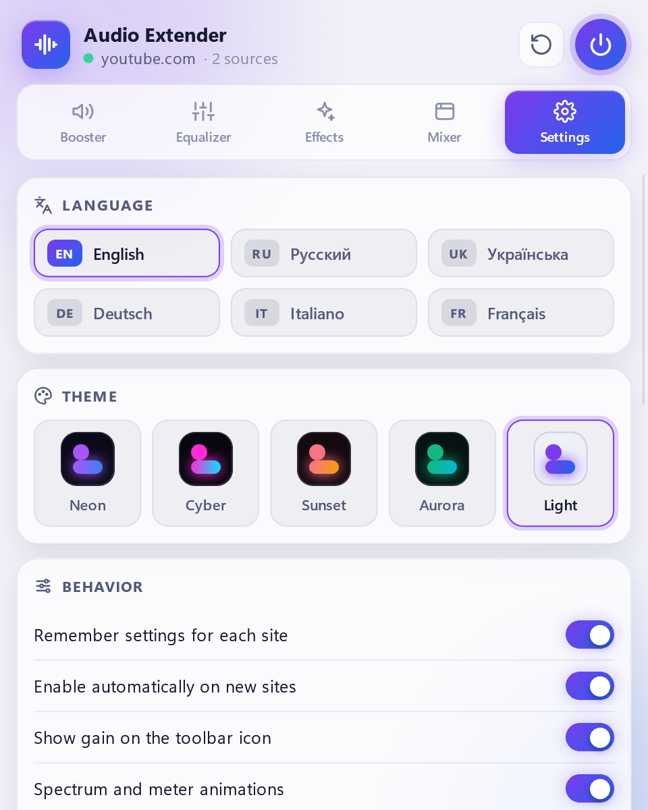

# Audio Extender

**Make any website sound better in Firefox.** Too quiet video? Voices lost behind music? Headphones that sound flat? Audio Extender boosts the volume up to 600% without distortion, gives you a real studio-grade equalizer and fixes the sound of every tab — YouTube, Twitch, podcasts, online courses, browser games and more.

Free, no ads, no tracking.

  
  
  

## What you can do

**🔊 Make quiet videos loud** — raise the volume up to 600%. A built-in limiter keeps it clean: louder, but never crackling or distorted.

**🎚️ Shape the sound exactly how you like** — drag points on the equalizer curve to boost bass, bring out vocals or tame harsh highs. Prefer sliders? Switch to 10 or 31 bands. Ready-made presets (Bass Boost, Vocal, Podcast, Rock…) and your own saved presets are one click away.

**🎧 Correct your headphones** — pick your model from a database of thousands of headphones (AutoEq) and hear them as they should sound.

**✨ Fix common problems with one switch**
- **Clear dialogue** — understand voices in films and streams even when the music is loud
- **Night mode** — quiet scenes louder, explosions quieter, so nobody wakes up
- **Bass boost** and **stereo width** — more punch and a wider stage
- **Normalization** — every video plays at a similar loudness, no more jumping for the volume knob
- **Mono** and **left/right balance** — for one earbud or hearing on one side
- **Playback speed** — speed up lectures and podcasts without chipmunk voices

**🎛️ Control all tabs from one place** — the Mixer lists every tab playing sound: set each one's volume, mute it, play one solo, or lower other tabs automatically while you watch something.

**💾 It remembers** — settings are saved per site, so YouTube and Twitch can each sound the way you like. Everything stays after a browser restart.

  
  

## Install

**[Get Audio Extender on Firefox Add-ons →](https://addons.mozilla.org/firefox/addon/audio-extender/)**

Click *Add to Firefox* on the official Mozilla page — updates then arrive automatically. Requires Firefox 142 or newer, on the computer or on Android (on Android there is no sidebar, no keyboard shortcuts and no muting of tabs).

## How to use

1. Open a page with sound and click the **Audio Extender** button in the toolbar.
2. Turn the gain dial, pick an EQ preset or switch on an effect — you hear the change instantly.
3. That's it: the settings are remembered for this site. The **⏻** button turns processing off, **↺** resets the site to default.

**Keyboard shortcuts**

| Action | Shortcut |
|---|---|
| Open Audio Extender | `Alt` + `Shift` + `A` |
| Volume +10% | `Alt` + `Shift` + `↑` |
| Volume −10% | `Alt` + `Shift` + `↓` |
| Turn processing on / off | `Alt` + `Shift` + `B` |

You can change them in `about:addons` → ⚙ → *Manage Extension Shortcuts*.

Prefer a bigger panel? Turn on **Open in sidebar** in Settings.

## Themes and languages

Five themes — **Neon**, **Cyber**, **Sunset**, **Aurora** and **Light** — and six languages: English, Русский, Українська, Deutsch, Italiano, Français.

## Where it can't work, and why

Audio Extender tells you in the panel when a page can't be processed:

- **Firefox's own pages** (settings, about: pages, the PDF viewer, addons.mozilla.org) — Firefox doesn't allow any extension there.
- **Protected (DRM) music and video**, such as Spotify or Netflix — the browser doesn't let extensions change protected audio. It keeps playing normally, just without effects.
- **Some audio loaded from another website** — if that website doesn't permit processing, the sound plays unchanged instead of going silent.
- **Private windows** — only if you allow the extension there (`about:addons` → Audio Extender → *Run in Private Windows*).

## Privacy

Audio Extender collects **no data** and has no ads or analytics. All sound processing happens on your computer, inside the browser. The only time it connects to the internet is when you search for your headphones — then it downloads the public [AutoEq](https://github.com/jaakkopasanen/AutoEq) database from GitHub.

## Feedback

Found a bug or have an idea? [Open an issue](https://github.com/AlexeyKopkin/Audio-Extender/issues). Developers and translators — see [CONTRIBUTING.md](CONTRIBUTING.md).

## Support the project

Audio Extender is free and ad-free. If it makes your day a little louder, you can [buy me a coffee](https://buymeacoffee.com/kotx) ☕

## License

[GNU General Public License v3.0](LICENSE).

The license covers the source code only. The name **“Audio Extender”** and its logo are not licensed for use by forks or derivative works — please use a different name and logo for your own version.
