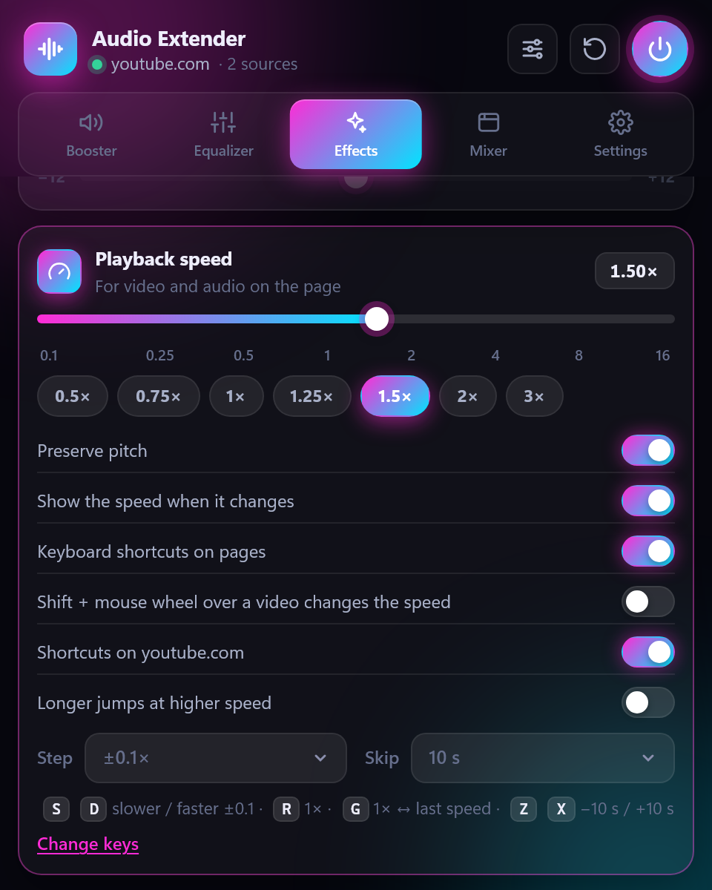

# Audio Extender

**Make any website sound better — in Firefox, Chrome and Edge.** Too quiet video? Voices lost behind music? Headphones that sound flat? Audio Extender boosts the volume up to 600% without distortion, gives you a real studio-grade equalizer, a video speed controller and a mixer for every tab — YouTube, Twitch, podcasts, online courses, browser games and more.

Free, no ads, no tracking, open source.

  
  
  

## Install

| Browser | |
|---|---|
| **Firefox** (computer and Android) | **[Get it on Firefox Add-ons →](https://addons.mozilla.org/firefox/addon/audio-extender/)** |
| **Google Chrome** | **[Get it on the Chrome Web Store →](https://chromewebstore.google.com/detail/nnhpjimaflnmloilfhnahpomcchgafpn)** |
| **Microsoft Edge** | **[Get it on Edge Add-ons →](https://microsoftedge.microsoft.com/addons/detail/ilfkgdbebjkfjpledogkfcpgmpbolifi)** |

Install it from the official store page of your browser — updates then arrive automatically. Requires Firefox 142, Chrome 116 or Edge 116 or newer.

## What you can do

**🔊 Make quiet videos loud** — raise the volume up to 600%. A built-in limiter keeps it clean: louder, but never crackling or distorted. Set your own maximum if you like (150–600%).

**🎚️ Shape the sound exactly how you like** — drag points on the equalizer curve to boost bass, bring out vocals or tame harsh highs. Prefer sliders? Switch to 10 or 31 bands. Ready-made presets (Bass Boost, Vocal, Podcast, Rock…) and your own presets fit whichever equalizer is on.

**🎧 Correct your headphones** — pick your model from a database of thousands of headphones (AutoEq) and hear them as they should sound.

**⏩ Control the speed of any video** — 0.1× to 16× with the keys video-speed fans already know: `S` / `D` slower / faster, `R` back to 1×, `G` between 1× and your last speed, `Z` / `X` jump back / forward. A short "1.5×" badge confirms the change, then gets out of the way — no permanent overlay. Every key can be changed or turned off, also per site; optional hold-for-2×, A-B loop and frame steps.

**✨ Fix common problems with one switch**
- **Clear dialogue** — understand voices in films and streams even when the music is loud
- **Night mode** — quiet scenes louder, explosions quieter, so nobody wakes up
- **Bass boost**, **stereo width** and **pitch** — more punch, a wider stage, voices higher or lower at any speed
- **Normalization** — every video plays at a similar loudness, no more jumping for the volume knob
- **Mono** and **left/right balance** — for one earbud or hearing on one side

**🎛️ Control all tabs from one place** — the Mixer lists every tab playing sound: set each tab's volume (even two tabs of the same site), mute it, play one solo, give all tabs the same loudness, or lower other tabs automatically while you watch something.

**🔈 Play each tab on its own device** — send a video to your headphones while music keeps playing on the speakers.

**💾 It remembers** — settings are saved per site, so YouTube and Twitch can each sound the way you like. Save a site's sound as a profile and apply it anywhere in one click; sync your settings through your browser account if you want.

  
  
  

## How to use

1. Open a page with sound and click the **Audio Extender** button in the toolbar.
2. Turn the gain dial, pick an EQ preset or switch on an effect — you hear the change instantly.
3. That's it: the settings are remembered for this site. The **⏻** button turns processing off, **↺** resets the site to default.

**Keyboard shortcuts**

| Action | Shortcut |
|---|---|
| Open Audio Extender | `Alt` + `Shift` + `A` |
| Volume +10% | `Alt` + `Shift` + `↑` |
| Volume −10% | `Alt` + `Shift` + `↓` |
| Turn processing on / off | `Alt` + `Shift` + `B` |
| Speed faster / slower / 1× | not set — assign your own keys |

Change them from **Settings → Keyboard shortcuts** (the link opens your browser's shortcut page).

Prefer a bigger panel? Turn on **Open in sidebar** (Firefox) or **Open in side panel** (Chrome, Edge) in Settings.

## Themes and languages

Five themes — **Neon**, **Cyber**, **Sunset**, **Aurora** and **Light** — and six languages: English, Русский, Українська, Deutsch, Italiano, Français.

## Where it can't work, and why

Audio Extender tells you in the panel when a page can't be processed:

- **The browser's own pages** (settings, `about:` / `chrome://` / `edge://` pages, the PDF viewer, the browser's add-on store) — no browser allows extensions there.
- **Protected (DRM) music and video**, such as Spotify or Netflix — the browser doesn't let extensions change protected audio. It keeps playing normally, just without effects.
- **Some audio loaded from another website** — if that website doesn't permit processing, the sound plays unchanged instead of going silent. In Chrome and Edge, **Deep mode** can process such a tab anyway (the browser then shows that the tab is being shared).
- **Private windows** — only if you allow the extension there in your browser's extension settings.
- **Choosing an output device** is not available in Firefox for Android; in Chrome and Edge it uses Deep mode and needs a one-time microphone permission to show device names (nothing is recorded).

## Privacy

Audio Extender collects **no data** and has no ads or analytics. All sound processing happens on your computer, inside the browser. The only time it connects to the internet is when you search for your headphones — then it downloads the public [AutoEq](https://github.com/jaakkopasanen/AutoEq) database from GitHub. If you turn on settings sync, your settings travel through your own browser account.

## Feedback

Found a bug or have an idea? [Open an issue](https://github.com/AlexeyKopkin/Audio-Extender/issues). Developers and translators — see [CONTRIBUTING.md](CONTRIBUTING.md).

## Support the project

Audio Extender is free and ad-free. If it makes your day a little louder, you can [buy me a coffee](https://buymeacoffee.com/kotx) ☕

## License

[GNU General Public License v3.0](LICENSE).

The license covers the source code only. The name **“Audio Extender”** and its logo are not licensed for use by forks or derivative works — please use a different name and logo for your own version.
